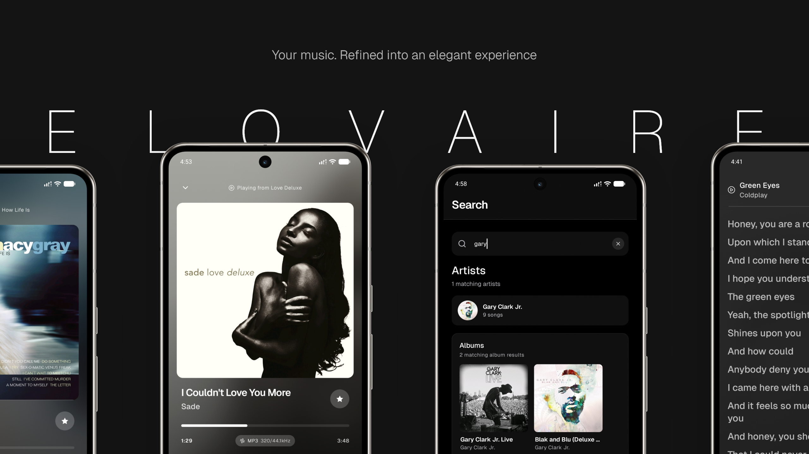
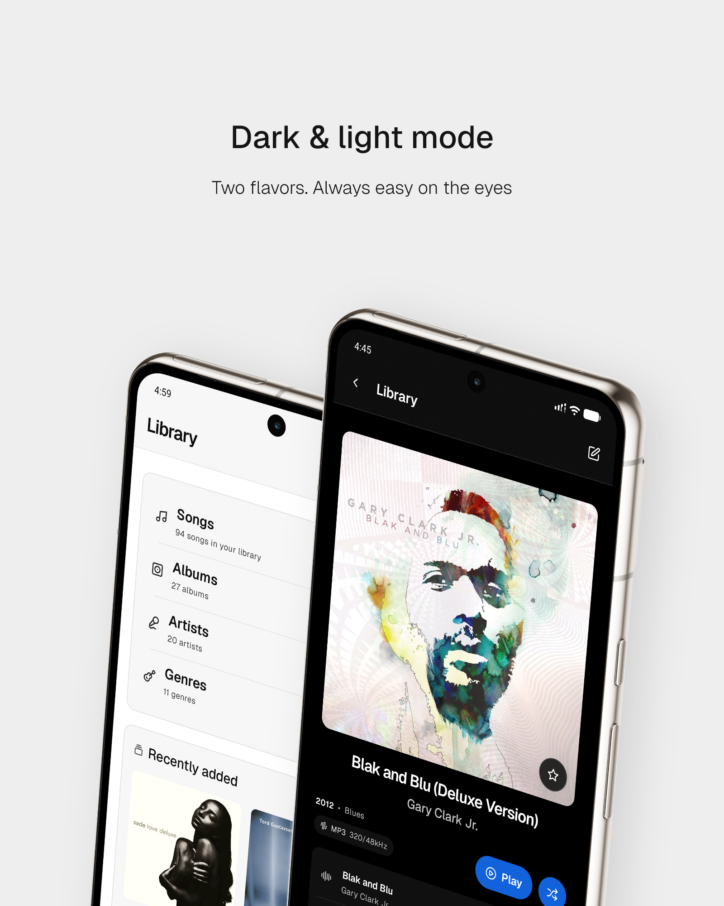
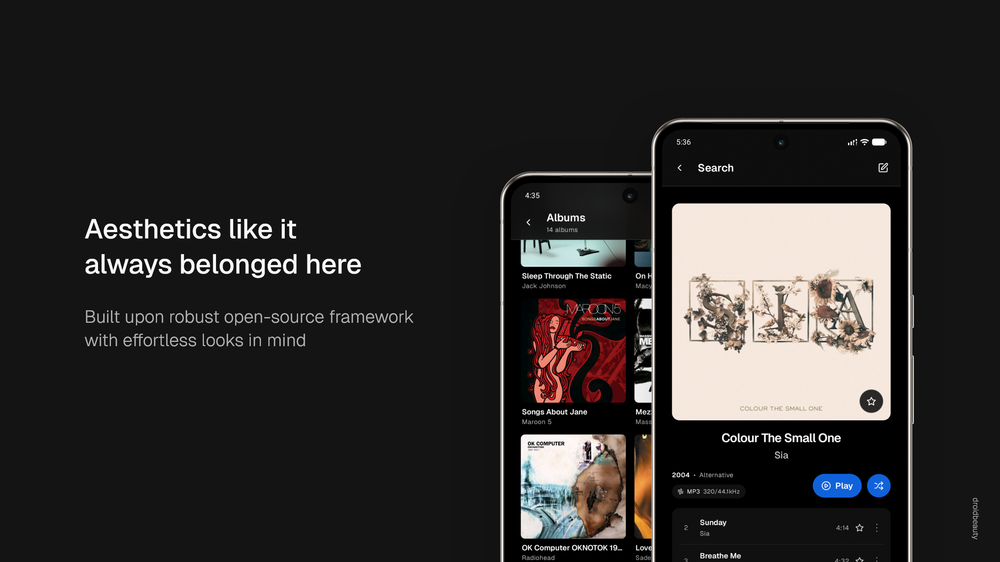
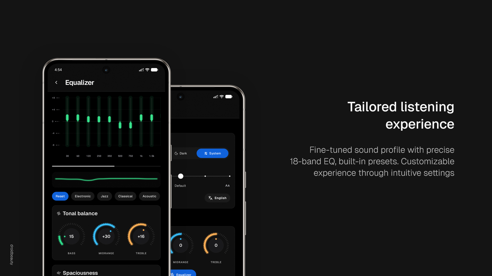

# Elovaire

  <b>Your music, given room to shine.</b>

  An elegant Android music player for the collection you call your own. Browse, search and play your music offline, with album artwork at the heart of the experience.

## A library that feels like yours

Explore songs, albums, artists, genres and playlists in one calm, artwork-rich library. Search your collection, save favorites, build playlists and pick up where you left off. Your library can refresh as your music changes.

## Keep the focus on the music

The full player puts album art front and center, with your queue, lyrics, volume, shuffle and repeat close at hand. A compact mini-player keeps playback within reach while you browse. Look up lyrics online or use lyrics stored with your music.

## Make the sound your own

Shape playback with an 18-band equalizer, ready-made presets and hands-on controls for bass, midrange and treble. Add spaciousness or reverb to suit the way you like to listen.

## A considered look, your way

Choose light, dark or system theme, adjust text size, and enjoy subtle motion and soft, frosted surfaces that let the artwork set the mood.

## Support

Elovaire is an independent project built for people who love their own music. There are no ads; if you enjoy using it, a tip helps support its development.

  

